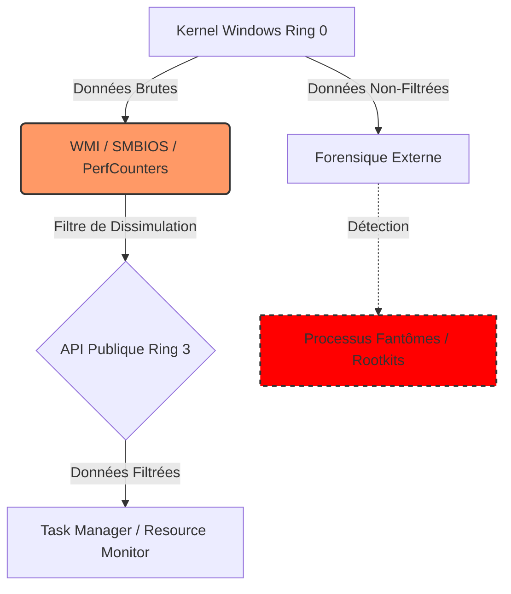

# 👁️ WSSP-Forensics : Windows Systemic Surveillance Patterns

> "Les incohérences mathématiques observées ne sont pas des bugs, mais des caractéristiques fonctionnelles d'une infrastructure de dissimulation."

## 📑 Synopsis

**WSSP-Forensics** est un projet de recherche technique visant à documenter, quantifier et analyser les anomalies systémiques présentes dans les outils de surveillance natifs de Windows (Task Manager, Resource Monitor, Performance Counters).

L'analyse démontre que les écarts entre les ressources rapportées et la somme réelle des processus visibles dépassent les marges d'erreur statistique (erreurs d'arrondi), suggérant l'existence de "Processus Fantômes" et d'une opacité architecturale délibérée (exploitation WMI/SMBIOS, CVE-2022-37969). Ce dépôt propose une approche symbiotique utilisant l'IA et l'analyse forensique externe pour restaurer la transparence du système.

## 📐 Formalisme Mathématique de la Dissimulation

Nous modélisons l'incohérence du système de surveillance par l'équation de divergence des ressources ($D_{res}$).

Soit $R_{total}$ la ressource totale rapportée par l'API système (ex: RAM globale utilisée).
Soit $P_i$ la consommation rapportée pour chaque processus visible $i$ dans l'ensemble $V$ (processus visibles).
Soit $\epsilon$ la marge d'erreur admissible due à l'échantillonnage et aux arrondis.

L'hypothèse nulle ($H_0$) d'un système transparent est définie par :

$$
\left| R_{total} - \sum_{i \in V} P_i \right| \leq \epsilon
$$

Cependant, nos observations forensiques montrent une divergence systématique $\Delta$ telle que :

$$
\Delta = R_{total} - \sum_{i \in V} P_i \gg \epsilon
$$

Cette divergence $\Delta$ quantifie la charge des **Processus Fantômes** ($\Phi$) et de la télémétrie dissimulée :

$$
\Phi \approx \Delta - \int_{t_0}^{t} \text{Entropy}(S) dt
$$

Où $\text{Entropy}(S)$ représente la dégradation naturelle du système (dette technique). La persistance de $\Phi$ après correction des CVEs indique une architecture de surveillance maintenue.

## 🧩 Architecture de l'Opacité

Le diagramme ci-dessous illustre le flux de dissimulation identifié entre le Kernel et l'interface utilisateur.

## 📊 Métrologie et Preuves

Le projet catalogue les vecteurs de dissimulation suivants :

| Vecteur | Anomalie Observée | Impact de Sécurité | Référence |
| --- | --- | --- | --- |
| **Mémoire (RAM)** |  entre Total et Somme() | Masquage de malwares résidents | Forensique Volatility |
| **PerfCounters** | Valeurs incohérentes post-exploitation | Falsification de l'état système | CVE-2022-37969 |
| **CLI React Native** | Injection de commande arbitraire | Contournement de sécurité | CVE-2025-64328 |
| **Boot Process** | Contournement Secure Boot | Persistance Kernel-level | BlackLotus (CVE-2022-21894) |

## 🚀 Applications et Roadmap

L'objectif est de développer une suite d'outils de "Contre-Mesure Symbiotique".

* [ ] **Phase 1 : Audit** - Script Python pour calculer  en temps réel sur la RAM et le CPU.
* [ ] **Phase 2 : Forensique** - Intégration automatisée de profils *Volatility* pour identifier les PIDs orphelins.
* [ ] **Phase 3 : IA Symbiotique** - Modèle prédictif pour distinguer l'entropie logicielle normale de l'exfiltration de données active.

## 📚 Références Clés

* Analyses CVE (Microsoft, NIST)
* Rapports Forensiques (Volatility Foundation, Rekall)
* Documentation sur l'Entropie Logicielle

---

**Maintenu par Bryan Ouellette et le Lichen-Collectives**
